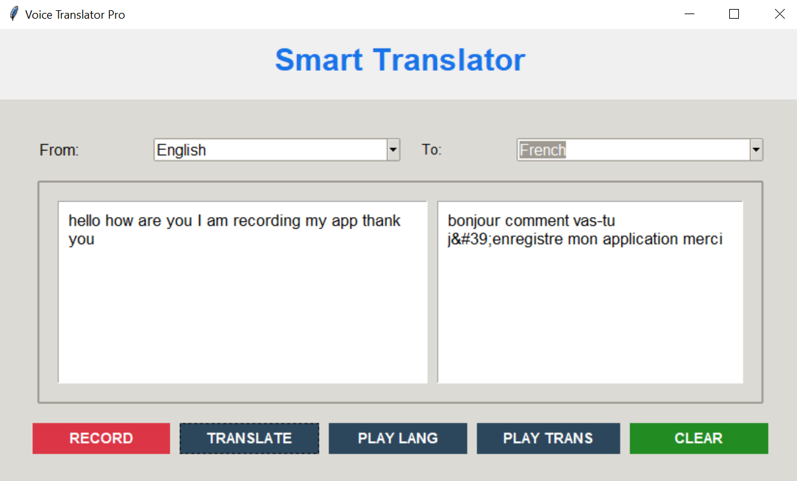

# Smart Translator App 🌐




[](https://github.com/fcozochi/smart-translator-app/releases/tag/v1.2.0)

A multi-API translation tool supporting **100+ languages** with text/voice capabilities.

---

## 📑 Table of Contents
- [Key Features](#-key-features)
- [Supported APIs](#-supported-apis)
- [Installation](#-installation)
- [Configuration](#-configuration)
- [Usage](#-usage)
- [Troubleshooting](#-troubleshooting)
- [Roadmap](#-roadmap)
- [Contributing](#-contributing)
- [License](#-license)

---

## ✨ Key Features

### **Core Translation**
- Text translation between **134 languages**
- Batch translation (up to 5k characters)
- Language auto-detection

### **Voice Features** 🎤
- Speech-to-text input
- Text-to-speech output
- Supports 40+ voice accents

### **Advanced Tools**
- Translation history (last 50 entries)
- Favorites/bookmark system
- Export translations to `.txt`/`.csv`

### **Technical**
- Multi-API fallback system
- Low-latency UI (60 FPS)
- Offline cache for frequent phrases

---

## 🔌 Supported APIs
| Service       | Free Tier | Key Required |
|---------------|-----------|--------------|
| Google Translate | ✅        | Optional      |
| DeepL Pro      | ❌        | Required      |
| OpenAI GPT-4   | ❌        | Required      |
| MyMemory       | ✅        | Optional      |

---

## ⚙️ Installation

### Requirements
- Python 3.8+
- 500MB disk space
- Internet connection

```bash
# Clone repository
git clone https://github.com/fcozochi/smart-translator-app.git
cd smart-translator-app

# Create virtual environment
python -m venv .venv
source .venv/bin/activate  # Linux/MacOS
.venv\Scripts\activate     # Windows

# Install dependencies
pip install -r requirements.txt